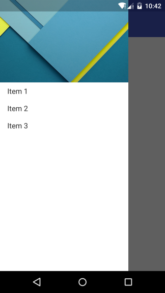
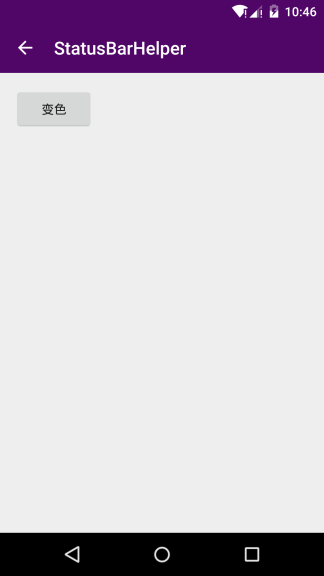
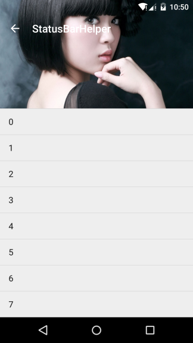
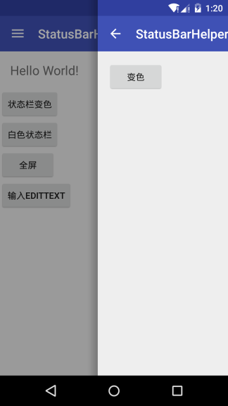

## StatusBarHelper ##

### 描述 ###

提供可同时设置4.4和5.x以上沉浸状态栏的解决方案，支持全屏显示，处理了AdjustResize的问题，支持DrawerLayout以及滑动返回（[SwipeBackLayout][1]）。更多信息可参考：[Android 沉浸状态栏][2]。

### 效果图 ###







### 用法 ###

```java
StatusBarHelper helper = new StatusBarHelper(
        /*Activity*/
        this,
        /**
         * level used in 4.4, below value can be set:
         * LEVEL_NONE (if you don't need tint StatusBar)
         * LEVEL_19_TRANSLUCENT (set TRANSLUCENT StatusBar and tint)
         */
        StatusBarHelper.LEVEL_19_TRANSLUCENT,
        /**
         * level used in 5.x, can be set:
         * LEVEL_NONE (if you don't need tint StatusBar)
         * LEVEL_21_NORMAL (use API in 5.x to tint StatusBar)
         * LEVEL_21_NORMAL_FULL (use API in 5.x to tint StatusBar and set full screen)
         * LEVEL_21_VIEW (use a View to tint StatusBar that like LEVEL_19_TRANSLUCENT)
         */
        StatusBarHelper.LEVEL_21_NORMAL
);
// set background color
helper.setColor(getResources().getColor(R.color.colorPrimaryDark));
// or set background drawable
// helper.setDrawable(new ColorDrawable(Color.BLUE));
```

## License ##

	Copyright 2016 naturs

	Licensed under the Apache License, Version 2.0 (the "License");
	you may not use this file except in compliance with the License.
	You may obtain a copy of the License at

	http://www.apache.org/licenses/LICENSE-2.0

	Unless required by applicable law or agreed to in writing, software
	distributed under the License is distributed on an "AS IS" BASIS,
	WITHOUT WARRANTIES OR CONDITIONS OF ANY KIND, either express or implied.
	See the License for the specific language governing permissions and
	limitations under the License.

[1]:https://github.com/ikew0ng/SwipeBackLayout
[2]:http://blog.csdn.net/mybeta/article/details/50760323